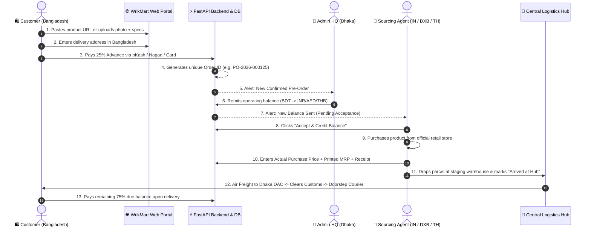

# 🌐 WrikMart — Global Pre-Order & Cross-Border Logistics Platform

[](https://reactjs.org/)
[](https://tailwindcss.com/)
[](https://fastapi.tiangolo.com/)
[](https://www.postgresql.org/)
[]()

> **WrikMart** is an enterprise cross-border pre-order commerce and logistics ecosystem that enables consumers in **Bangladesh 🇧🇩** to purchase genuine goods from official retailers and e-commerce websites in **India 🇮🇳, Dubai (UAE) 🇦🇪, and Thailand 🇹🇭** through on-ground purchasing agents, managed staging warehouses, and end-to-end doorstep logistics.

---

## 📑 Table of Contents

1. [Business Model & Core Workflows](#-business-model--core-workflows)
2. [Critical Business Rules & Data Isolation](#-critical-business-rules--data-isolation)
3. [System Architecture & Data Flow](#-system-architecture--data-flow)
4. [Platform Modules Overview](#-platform-modules-overview)
   - [1. Super Admin Control Suite](#1-super-admin-control-suite)
   - [2. Overseas Agent Sourcing Portal](#2-overseas-agent-sourcing-portal)
   - [3. Customer Pre-Order Storefront](#3-customer-pre-order-storefront)
5. [Database Schema (PostgreSQL DDL)](#-database-schema-postgresql-ddl)
6. [API Design & Endpoints Specification](#-api-design--endpoints-specification)
7. [Frontend Design Tokens & Styling Guide](#-frontend-design-tokens--styling-guide)
8. [Local Development & Setup Guide](#-local-development--setup-guide)

---

## 💼 Business Model & Core Workflows



---

## 🔒 Critical Business Rules & Data Isolation

### 1. Strict Agent Data Isolation & Privacy Shield
- ❌ **Customer Selling Price is Strictly Hidden**: Agents never see what the customer was billed or the profit markup.
- ❌ **Customer Contact Details are Strictly Hidden**: Customer name, phone number, and physical address are masked to prevent unauthorized communication and side-deals.
- ✅ **Agent Visibility Scope**: Agents only receive the `Order ID`, product links, images, quantities, size, color, and technical specifications.

### 2. Dual-Ledger Accounting System
- **Customer Ledger (`customer_payments`)**: Records customer advance payments (25%), gateway transaction IDs (bKash/Nagad/Cards), and doorstep cash collection.
- **Agent Operating Ledger (`agent_ledger`)**: Records HQ balance remittances, exchange rate conversions (BDT &rarr; INR/AED/THB), purchase cost debits, and operational expense reimbursements.
- **Strict Rule**: Customer payments never mix directly into the agent's wallet without formal HQ remittance.

### 3. Balance Remittance & Two-Way Acceptance Protocol
- When Admin sends funds from Bangladesh, the transfer is placed in `Pending Acceptance` state.
- Funds are only credited to the Agent's active operating wallet after the Agent reviews the conversion rate and clicks **"Accept & Credit Balance"** on their dashboard.

### 4. Mandatory Purchase Price & Printed MRP Recording
- Agents cannot mark an item as delivered to the staging hub without submitting:
  1. **Actual Purchase Price** (in local currency e.g., INR, AED, THB).
  2. **Printed MRP** (Manufacturer Retail Price).
  3. **Official Tax Receipt / Store Invoice Photo**.

---

## 🏗️ System Architecture & Data Flow

```
+-----------------------------------------------------------------------------------+
|                            Cloudflare / CDN Edge Layer                            |
+-----------------------------------------+-----------------------------------------+
                                          |
                   +----------------------+----------------------+
                   |                                             |
+------------------v-------------------+     +-------------------v------------------+
|      React 18 + Vite Web App         |     |       FastAPI Backend Service        |
|  - Full-Width Desktop Website        |     |  - OAuth2 / JWT Authentication       |
|  - Mobile-First Responsive PWA       | REST|  - Pre-Order & Pricing Engine        |
|  - Role Workspace Switcher           |<===>|  - Multi-Currency FX Engine          |
|  - Real-time Order Tracking Timeline |     |  - Webhook Handlers (bKash / Nagad)  |
+--------------------------------------+     +-------------------+------------------+
                                                                 |
                                    +----------------------------+----------------------------+
                                    |                                                         |
                     +--------------v--------------+                           +--------------v--------------+
                     |    PostgreSQL 16 Database   |                           |    Redis Cache & Workers    |
                     |  - Strict Dual Ledgers      |                           |  - Real-time WebSocket Hub  |
                     |  - Audit Trail Snapshots    |                           |  - Async Currency Sync      |
                     |  - Role-Based Access Control|                           |  - Notification Triggers    |
                     +-----------------------------+                           +-----------------------------+
```

---

## 📱 Platform Modules Overview

### 1. Super Admin Control Suite

| Sub-Module | Capabilities |
| :--- | :--- |
| **Executive Dashboard** | Top KPI cards (Orders: 2,548, Customers: 1,685, Agents: 58, Revenue: ৳42,95,300), 7-day bar chart volume trends, status doughnut charts, and recent pre-orders table. |
| **Order Management & 360° View** | Full customer PII inspection, assigned agent details, item specifications, store links, and **Gross Profit Margin Calculator** (`Selling Price - Purchase Cost - Delivery = Gross Margin`). |
| **Agent Balance & Remittance** | Live multi-currency conversion (1 BDT = 0.70 INR, 0.0308 AED, 0.282 THB), remittance dispatch, and pending acceptance tracking ledger. |
| **Hub & Warehouse Logistics** | Managing staging facilities in **Dhaka Main Hub**, **Chittagong**, **Delhi Gateway**, **Dubai Central**, and **Bangkok Logistics Hub**. |
| **Expense Management** | Reviewing and approving overseas agent operational overheads (Travel, Fuel/Petrol, Daily Allowance, Bubble Wrap & Packaging). |
| **Pre-Order Form Settings** | Public URL generator (`https://wrikmart.com/pre-order`), country availability switches, and mandatory form fields checklist. |
| **Reports & Financial Analytics** | Gross profit margins by product category, country-specific sourcing volume, and fulfillment efficiency reports. |
| **System Settings & RBAC** | Live FX exchange rate configuration, payment gateway API keys, and role permission tables. |

---

### 2. Overseas Agent Sourcing Portal (India 🇮🇳, Dubai 🇦🇪, Thailand 🇹🇭)

- **Operating Balance Wallet**: Real-time balance display in native local currency (₹ INR, د.إ AED, ฿ THB).
- **Remittance Acceptance Modal**: Instant banner and modal for accepting incoming HQ funds with conversion breakdown.
- **Data-Masked Order List**: Searchable by Order ID (`PO-2026-XXXXXX`) with customer privacy protection.
- **Product Link & Visual Inspector**: One-click **"Copy Link"** for instant sourcing in store/browser and high-resolution photo viewer.
- **Mandatory Purchase Update Screen**: Purchase price, printed MRP, vendor name, and receipt photo upload.
- **Which Hub Delivery**: Drop-off routing selector with manager contact details and **"Mark as Arrived at Hub"** action.
- **Agent Expense Logger**: Submitting travel/fuel bills with attached voucher photos.
- **HQ Direct Chat**: Live messaging line with Dhaka support team.

---

### 3. Customer Pre-Order Storefront

- **Desktop & Mobile Responsive Experience**: Full-width landing portal with dynamic search input, supported stores (Nike, Apple, Zara, Amazon, Noon, Shopee), and 4-step infographic.
- **Interactive 4-Step Pre-Order Wizard**:
  - **Step 1 — Country & Link**: Choose between India 🇮🇳, Dubai 🇦🇪, or Thailand 🇹🇭; paste product URL or upload screenshot.
  - **Step 2 — Specifications**: Select size, color, quantity counter, customer expected budget in ৳ BDT, and special remarks.
  - **Step 3 — Multi-Product Cart**: Support for multiple items in a single consignment (`+ Add Another Product`).
  - **Step 4 — Customer Details**: Recipient name, WhatsApp number, email, delivery address in Bangladesh, and district.
  - **Step 5 — Advance Payment & Gateway**: Automated calculation of 25% Advance + ৳200 BD courier charge with official **bKash**, **Nagad**, and **Card** gateways.
  - **Step 6 — Celebration & Invoice**: Confetti animation, generated Order ID, and printable invoice sheet.
- **9-Stage Live Order Tracking Timeline**:
  1. *Order Placed* &rarr; 2. *Payment Confirmed* &rarr; 3. *Agent Assigned* &rarr; 4. *Product Purchased* &rarr; 5. *Arrived at Hub* &rarr; 6. *Shipped to Bangladesh* &rarr; 7. *Bangladesh Received* &rarr; 8. *Ready for Delivery* &rarr; 9. *Delivered & Due Collected*.

---

## 🗄️ Database Schema (PostgreSQL DDL)

```sql
-- 1. Users Table
CREATE TABLE users (
    id UUID PRIMARY KEY DEFAULT gen_random_uuid(),
    full_name VARCHAR(150) NOT NULL,
    email VARCHAR(150) UNIQUE,
    phone VARCHAR(30) UNIQUE NOT NULL,
    role VARCHAR(20) NOT NULL DEFAULT 'customer', -- 'super_admin', 'admin', 'agent', 'customer'
    country VARCHAR(50) DEFAULT 'Bangladesh',
    is_active BOOLEAN DEFAULT TRUE,
    created_at TIMESTAMP WITH TIME ZONE DEFAULT NOW()
);

-- 2. Agents Table
CREATE TABLE agents (
    id UUID PRIMARY KEY DEFAULT gen_random_uuid(),
    user_id UUID NOT NULL REFERENCES users(id) ON DELETE CASCADE,
    country VARCHAR(50) NOT NULL, -- 'India', 'Dubai', 'Thailand'
    currency_code VARCHAR(3) NOT NULL, -- 'INR', 'AED', 'THB'
    current_balance DECIMAL(15, 2) NOT NULL DEFAULT 0.00,
    total_spent DECIMAL(15, 2) NOT NULL DEFAULT 0.00,
    status VARCHAR(20) DEFAULT 'Active',
    created_at TIMESTAMP WITH TIME ZONE DEFAULT NOW()
);

-- 3. Delivery Staging Hubs
CREATE TABLE delivery_hubs (
    id UUID PRIMARY KEY DEFAULT gen_random_uuid(),
    hub_name VARCHAR(100) NOT NULL,
    country VARCHAR(50) NOT NULL,
    location_address TEXT NOT NULL,
    manager_name VARCHAR(100),
    contact_phone VARCHAR(30),
    is_active BOOLEAN DEFAULT TRUE
);

-- 4. Pre-Orders Master Table
CREATE TABLE orders (
    id UUID PRIMARY KEY DEFAULT gen_random_uuid(),
    order_number VARCHAR(50) UNIQUE NOT NULL, -- 'PO-2026-000125'
    customer_id UUID NOT NULL REFERENCES users(id),
    target_country VARCHAR(50) NOT NULL,
    status VARCHAR(30) NOT NULL DEFAULT 'Processing',
    payment_status VARCHAR(30) NOT NULL DEFAULT 'Advance Paid',
    
    -- Customer Selling Financials
    estimated_subtotal DECIMAL(12, 2) NOT NULL DEFAULT 0.00,
    delivery_charge DECIMAL(10, 2) NOT NULL DEFAULT 200.00,
    estimated_total DECIMAL(12, 2) NOT NULL DEFAULT 0.00,
    advance_amount_paid DECIMAL(12, 2) NOT NULL DEFAULT 0.00,
    due_amount DECIMAL(12, 2) NOT NULL DEFAULT 0.00,
    
    -- Agent & Logistics Assignment
    assigned_agent_id UUID REFERENCES agents(id),
    delivery_hub_id UUID REFERENCES delivery_hubs(id),
    purchase_deadline DATE,
    
    -- Customer Delivery Address Snapshot
    customer_name_snapshot VARCHAR(150),
    customer_phone_snapshot VARCHAR(30),
    delivery_address TEXT,
    created_at TIMESTAMP WITH TIME ZONE DEFAULT NOW()
);

-- 5. Order Line Items
CREATE TABLE order_items (
    id UUID PRIMARY KEY DEFAULT gen_random_uuid(),
    order_id UUID NOT NULL REFERENCES orders(id) ON DELETE CASCADE,
    product_name VARCHAR(255) NOT NULL,
    product_url TEXT,
    product_image_url TEXT,
    variant_details JSONB, -- {"size": "42", "color": "Black"}
    quantity INT NOT NULL DEFAULT 1,
    customer_expected_price DECIMAL(12, 2),
    
    -- Agent Purchase Tracking (Restricted from Customer view)
    actual_purchase_price DECIMAL(12, 2),
    actual_purchase_currency VARCHAR(3),
    mrp DECIMAL(12, 2),
    purchased_from VARCHAR(150),
    purchase_date TIMESTAMP WITH TIME ZONE,
    receipt_image_url TEXT,
    notes TEXT
);

-- 6. Agent Balance Remittance Ledger
CREATE TABLE agent_balance_transfers (
    id UUID PRIMARY KEY DEFAULT gen_random_uuid(),
    transfer_reference VARCHAR(50) UNIQUE NOT NULL,
    agent_id UUID NOT NULL REFERENCES agents(id),
    amount_bdt DECIMAL(15, 2) NOT NULL,
    conversion_rate DECIMAL(10, 4) NOT NULL,
    amount_target_currency DECIMAL(15, 2) NOT NULL,
    target_currency VARCHAR(3) NOT NULL,
    status VARCHAR(20) NOT NULL DEFAULT 'Pending', -- 'Pending', 'Accepted', 'Rejected'
    admin_note TEXT,
    transferred_at TIMESTAMP WITH TIME ZONE DEFAULT NOW()
);
```

---

## 🔌 API Design & Endpoints Specification

### Authentication & Profiles
- `POST /api/v1/auth/login` — JWT bearer token issuance with role scopes.
- `GET  /api/v1/auth/me` — Current authenticated user profile.

### Customer Pre-Order Endpoints
- `POST /api/v1/orders/pre-order` — Submit pre-order items, specs, and recipient address.
- `POST /api/v1/payments/advance/initialize` — Initiate bKash / Nagad / Card checkout intent.
- `POST /api/v1/payments/webhook` — Gateway IPN / Webhook verification callback.
- `GET  /api/v1/orders/{order_id}/tracking` — Public 9-stage order tracking pipeline.

### Agent Station Endpoints (Data Masked)
- `GET  /api/v1/agent/orders` — List assigned orders (Customer name, phone, price excluded).
- `POST /api/v1/agent/orders/{order_id}/purchase-update` — Submit Purchase Price, MRP, and receipt.
- `POST /api/v1/agent/orders/{order_id}/deliver-hub` — Mark parcel as arrived at designated hub.
- `POST /api/v1/agent/balance-transfers/{id}/accept` — Accept pending remittance and credit wallet.
- `POST /api/v1/agent/expenses` — Submit travel, petrol, and operational receipts.

### Super Admin Endpoints
- `GET  /api/v1/admin/dashboard/stats` — KPI cards, 7-day bar chart, country distribution.
- `GET  /api/v1/admin/orders/{order_id}/360` — Complete order view with profit margin calculation.
- `POST /api/v1/admin/agent/send-balance` — Remit funds to agent with real-time FX rate calculation.
- `PUT  /api/v1/admin/settings/fx-rates` — Update base currency exchange rates.

---

## 🎨 Frontend Design Tokens & Styling Guide

| Token | Value | Description |
| :--- | :--- | :--- |
| **Brand Primary** | `#0AA79D` (Teal/Cyan) | Main CTA buttons, highlights, active icons |
| **Brand Dark** | `#08867E` / `#054844` | Gradients, hover states |
| **Navy Background** | `#0D1B3D` / `#08132B` | Header, sidebar navigation, footer |
| **Surface Background** | `#F2F7FB` / `#F4F7FB` | Main workspace & page body background |
| **Success / Verified** | `#10B981` (Emerald) | Advance Paid, Approved, Delivered |
| **Pending / Attention** | `#F59E0B` (Amber) | Pending Acceptance, In Sourcing |
| **Typography** | `Inter`, `Outfit`, `sans-serif` | Clean, high-legibility geometric sans-serif |

---

## 🚀 Local Development & Setup Guide

### Prerequisites
- Node.js (v18.0.0 or higher)
- npm or pnpm
- Git

### Installation & Run

```bash
# 1. Clone the repository
git clone https://github.com/mashkurulalamohi37/wrikmart.git

# 2. Navigate to project folder
cd wrikmart

# 3. Install dependencies
npm install

# 4. Start Vite local development server
npm run dev
```

Visit **`http://localhost:5173/`** in your browser.

### Production Build & Validation

```bash
# Build production bundle
npm run build

# Preview production build locally
npm run preview
```

---

## 👥 Contributors & License

- **Developed for**: WrikMart Cross-Border Logistics Ltd.
- **Repository**: [https://github.com/mashkurulalamohi37/wrikmart.git](https://github.com/mashkurulalamohi37/wrikmart.git)
- **Copyright**: © 2026 WrikMart. All rights reserved.
